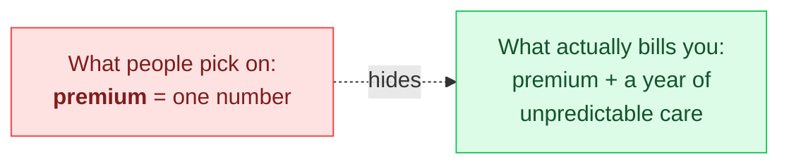
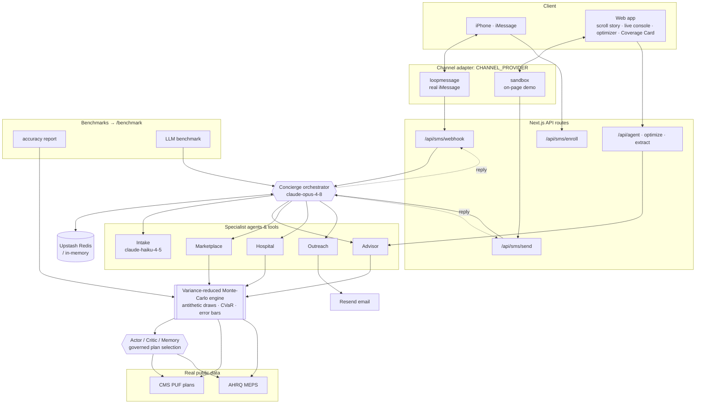

# Covera: the insurance marketplace that texts you the right plan

**Stuck with your employer's two options, or shopping on your own? Text Covera your
situation.** A team of AI agents searches the entire marketplace, simulates what you'd
truly pay, and answers any what-if. Once you choose, it reaches out to your employer or
hospital, and then it stays with you all year: estimating a procedure before you book it,
auditing a suspicious bill, drafting an appeal for a denial, and re-checking your plan at
open enrollment.

Every figure traces to public data. No synthetic plans, prices, or claims.

## What it does


| | Capability | What you get |
|---|---|---|
| 💬 | **Texting concierge** | A warm, multi-agent advisor you text like a person. It remembers your life: your fears, constraints, and preferences, not just your form fields. |
| 🎲 | **Real-time cost engine** | Every real plan ranked in closed form (milliseconds), then a Monte-Carlo pass sizes your bad-year tail. **Risk-adjusted all-in cost** (premium + out-of-pocket) with best/worst case, the odds you hit your OOP max, and the cost-vs-risk frontier. |
| 💊 | **Fits your drugs & doctors** | Real CMS formulary matching: a plan that drops one of your medications takes a ranking penalty and gets flagged, so "cheapest" never quietly means "does not cover your drug." |
| 🛡️ | **Year-round advocate** | It does not stop at enrollment: estimate a procedure before you book it, audit a bill against real charges, draft an appeal for a denied claim, and re-check your plan every open enrollment. |
| 🏪 | **Marketplace comparator** | Your employer offer vs. the **whole on-exchange market**, net of the subsidy you actually qualify for. |
| 🪪 | **Coverage Card** | A portable QR/link card: providers see your coverage and a live cost estimate with **zero access to your records** (the card lives in the link). |
| 🧑‍⚕️ | **Three lenses** | Patient optimizer · Employer ICHRA modeler · Hospital cost desk: one engine, three views. Each is interactive: the **employer** tab models flat vs age-rated contributions and compares ICHRA against your current group plan; the **hospital** tab quotes a procedure on a scanned Coverage Card and runs a browser-side **bill auditor** that flags overcharges. |
| 📨 | **Outreach** | Drafts (and optionally sends) messages to your employer's HR or a hospital after you finalize a plan. |
| 📊 | **Benchmarks** | An honest, interactive accuracy scorecard, a multi-model LLM benchmark, and a live **claim-bundle explorer** that runs real episodes of care (a surgery, a maternity year) through the adjudication engine on real plans so you can see the exact math, at `/benchmark`. |

## Why simulate thousands of years?

A premium is **one number**. Your real cost is a **distribution**, and the two rarely agree.



Each simulated "year" samples your likely care from real AHRQ MEPS utilization data: how
many primary-care visits, labs, ER trips, prescriptions, plus your conditions and planned
events. It then runs that year through a plan's actual deductible, coinsurance, and
out-of-pocket-max rules. **One** simulated year is just a guess. Run it **thousands** of
times and the shape emerges: a typical year, an expected cost, and the bad-year tail.

That tail is the whole point. Healthcare spending is extremely skewed: **the top 5% of
people drive ~50% of all spending**, so a single average hides the catastrophic year that
actually bankrupts people. Covera ranks plans on **expected cost + a downside-risk penalty**
(p90 cost, probability of hitting your OOP max), which is why the "cheapest" plan often
isn't the right one once your real risk is on the table.

## Past plain Monte-Carlo: a variance-reduced estimator + an actor/critic decision layer

Plain Monte-Carlo just resamples and averages. That is fine for a rough mean and a
histogram, but for a real decision it wastes draws and it can hand you a headline plan that
is technically cheapest yet quietly wrong. Covera scales the engine on two axes.

**1. The simulation now measures more than it resamples** (`lib/sim/estimators.ts`,
`lib/sim/utilization.ts`):

- **Antithetic sampling.** A whole year's cost hinges on one latent factor: person-year
  frailty. We now draw years as mirror-image pairs (frailty `+Z` and `-Z`), which cancels
  the dominant noise term in the mean. Same draw count, tighter estimate: on a real TX
  profile, 4,000 antithetic draws carry the precision of ~5,700 plain draws (a measured
  1.4x), and the ratio is reported, not assumed.
- **Coherent tail risk (CVaR).** p90 is a single point. **CVaR / expected shortfall** is the
  average cost across the *whole* worst-10%-of-years tail, and it is a coherent risk measure
  (convex, sub-additive) so ranking risk-averse patients on it is sound. On that same
  profile, p90 reads ~$7.5k while the true bad-year (CVaR90) is ~$10.3k.
- **Error bars.** Every headline number now ships a standard error (mean and p90), so two
  plans can be judged a genuine tie instead of flipping on sampling noise.

None of this is an LLM or a trained model: it is deterministic estimator math over the draws.

**2. Plan selection is an actor/critic/memory loop, not a bare `argmin`** (`lib/agents/selection/`).
This is the 7-step "medical agent from connected screens" roadmap applied to the decision:

| Step | Roadmap | In Covera |
| --- | --- | --- |
| 1 | Start with the real goal | Lowest risk-adjusted cost that keeps the patient's drugs and doctors, bounds the bad year, and stays affordable |
| 2 | Each screen is state | A decision walks connected screens: frame goal → shortlist → assess → check coverage → check tail risk → check affordability → substitute → finalize |
| 3 | Ground the screen with tools | The simulation is the tool: each screen reads real simulated numbers and coverage facts |
| 4 | Actor agent | Proposes **one** next pick at a time, best-first, and never finalizes before the checks |
| 5 | Critic agent | Blocks a pick that drops a required drug or doctor, prices the patient out, or leaves a risk-averse person a brutal CVaR; on a hard veto the actor substitutes the next plan |
| 6 | Memory | Short-term: the running trajectory. Long-term: critic-approved paths cached by situation and replayed for an identical patient (honest memoization, **not** training) |
| 7 | Runtime agent | `runSelection` drives actor→critic→memory to a governed pick plus a full, auditable decision path |

The critic is deterministic and reasons over the simulated numbers; the LLM concierge sits
above it and explains the verdict. When the critic hard-vetoes the raw cheapest, that plan is
demoted and the concierge is told exactly why, so the patient hears the reason instead of a
silent swap.

**3. The results view shows distinct choices, not near-duplicates** (`lib/sim/diversify.ts`).
A real marketplace is full of near-identical products, so ranking 24 plans hands the user a
wall of options clustered within $50 of each other. The curator first collapses twins (same
issuer, metal, and plan type at effectively the same deductible/OOP-max), then picks a small
set that seats the roles a shopper actually reasons in (best overall, safest bad year, lowest
premium, best HSA) and fills the rest by maximizing spread across the cost/risk plane, capped
per metal. On a real state that turns ~25 ranked plans into 5-6 genuinely different picks,
each with a one-line reason to exist; "see all" still reveals the full ranking.

## Defensible by construction: audit, trust, uploads, workers

A Monte-Carlo number nobody can inspect is not trustworthy. Every recommendation now ships an
explanation payload (`lib/sim/explain.ts`), surfaced in the results UI as a plain-English trust
panel:

- **Auditable cost waterfall** (`lib/sim/waterfall.ts`): the headline number decomposed by the
  exact mechanism that produced it, `premium + deductible phase + coinsurance + copays - OOP-max
  cap = expected annual`, reconciling to the cent. Each row is tagged as a hard **fact**, a
  modeling **assumption**, or a **derived** value. A separate view attributes modeled care to
  its source (your prescriptions, chronic condition care, planned events, everyday care).
- **Facts vs assumptions** (`lib/sim/facts.ts`): two labeled columns. Premium, deductible,
  OOP max, coinsurance, and formulary status are contractual facts from the CMS filing;
  utilization, allowed amounts, and catastrophic risk are assumptions from AHRQ MEPS, each with
  its source.
- **Scenario years** (`lib/sim/scenarios.ts`): normal, lighter-than-expected, high-utilization,
  a surgery year, a pregnancy year, and the worst-case in-network year (capped at the OOP max),
  each priced on the real plan.
- **Sensitivity** (`lib/sim/sensitivity.ts`): using the closed-form OOP curve, it states where a
  different plan overtakes the winner, anchored at the patient's own modeled spend. It is careful
  to compare cost at a spend level, which is not the same as the simulation's expected cost.
- **Trust / compliance** (`lib/trust/`): sources, assumptions, drug-coverage flags, network
  warnings, a precision statement (the mean's standard error and the CVaR bad-year), what could
  change the recommendation, and a fixed not-advice guardrail.
- **Deterministic claim bundles** (`lib/sim/bundles.ts`): diabetes meds, cardiology, therapy,
  arthritis meds, ER, imaging, a surgery episode, a maternity episode, and an inpatient stay,
  each a fixed fixture with a hand-checked expected out-of-pocket, so a refactor cannot silently
  change the cost math.

**Uploads feed the simulation** (`lib/documents/`). EOBs, medical bills, employer plan
summaries, prescription lists, and prior claim history parse into structured fields (extractor
interface + a labeled LLM extractor, swappable for a dedicated parser), then flow straight into
the engine: prescriptions merge into the profile, an employer plan becomes a scoreable `Plan`,
bill/EOB lines run through the deterministic auditor, denied lines become appeal candidates, and
year-to-date accumulators can refine the estimate. `POST /api/documents` takes a document's text
and returns the structured result with its extraction confidence.

**Slow work runs off the request path** (`lib/jobs/`). A provider-agnostic `JobQueue` interface
with an in-process default runner (retries, idempotency, follow-up enqueue) keeps ingestion,
formulary refreshes, procedure re-pricing, benchmarks, annual re-checks, and long simulations out
of request handlers. Business logic lives in plain handler functions, so swapping in BullMQ,
Inngest, Cloud Tasks, or Temporal later is one adapter, not a rewrite.

## System design



A **lead orchestrator** owns the conversation and delegates to specialist agents/tools; the
deterministic ones (advisor, marketplace, hospital) call the simulation so every number is
real, and the LLM sub-agents (intake, outreach) handle extraction and drafting. The channel
adapter makes delivery pluggable: real iMessage or the on-page sandbox.

**Code map:** `lib/agents/` (orchestrator + specialists: advisor, marketplace, hospital,
outreach, appeals; `selection/` = actor/critic/memory governance) · `lib/sim/` (analytic
closed-form ranker, variance-reduced Monte-Carlo engine + antithetic sampling, `estimators`
= CVaR + error bars, frailty calibration, formulary/network matching, bill audit, annual
re-check, ranking cache) ·
`lib/channel/` (sandbox / loopmessage) · `lib/store/` (Redis + memory fallback) ·
`lib/benchmark/` · `components/text/` (iMessage UI, scroll story, live console) ·
`app/api/sms/` · `scripts/{accuracy,benchmark}/`.

## Run it locally

```bash
npm install
cp .env.example .env.local      # optional: add only the keys you want
npm run dev                     # http://localhost:3000
```

**Nothing is required** to run, scroll the landing story, use the optimizer, build a Coverage
Card, or generate the accuracy report. Each service below unlocks more: the app degrades
gracefully when one is absent (exactly like the existing `ANTHROPIC_API_KEY` guard).

| Service | Required? | Unlocks | Get a key |
|---|---|---|---|
| _(none)_ | n/a | Optimizer, charts, Coverage Card, scripted landing story, `npm run accuracy` | n/a |
| **Anthropic** `ANTHROPIC_API_KEY` | Recommended | The live agent (in-app assistant, voice→profile, live console) and `npm run benchmark` | console.anthropic.com |
| **Upstash Redis** `UPSTASH_REDIS_REST_URL` / `_TOKEN` | Optional | Conversation memory that survives across texts and serverless cold starts (else in-memory) | upstash.com |
| **LoopMessage** `LOOPMESSAGE_*` + `CHANNEL_PROVIDER=loopmessage` | Optional | Real blue-bubble iMessage delivery (else the on-page sandbox console) | loopmessage.com |
| **Resend** `RESEND_API_KEY` / `OUTREACH_FROM_EMAIL` | Optional | Actually sending outreach to employers/hospitals (else draft-only preview) | resend.com |

```bash
npm test          # engine + agent unit tests
npm run typecheck # tsc --noEmit
npm run build     # production build
npm run accuracy         # data/accuracy-report.json   (no key needed)
npm run benchmark        # data/llm-benchmark.json      (needs ANTHROPIC_API_KEY)
npm run ingest           # rebuild data/plans.*.json from the CMS PUFs (~700MB download)
npm run ingest:prices    # real CMS Medicare physician prices into data/procedure-prices.json
npm run ingest:formulary # real CMS QHP drug formularies onto each plan
```

## Real data sources

| Need | Source |
|---|---|
| Plans, premiums, deductibles, OOP max, cost-sharing | **CMS Health Insurance Exchange Public Use Files, PY2026** (data.healthcare.gov) |
| Care utilization & expenditure calibration | **AHRQ Medical Expenditure Panel Survey (MEPS)** |
| Premium subsidies | ACA **APTC** via the second-lowest-cost silver benchmark |
| Procedure prices (billed & Medicare-allowed) | **CMS Medicare Physician & Other Practitioners by Geography and Service** (data.cms.gov), via `npm run ingest:prices` |
| Drug formularies (per-plan tier by drug) | **CMS QHP machine-readable formularies** (Machine-Readable URL PUF, PY2026 → issuer `index.json` → `drugs.json`), via `npm run ingest:formulary` |

Bundled states: **all 30 federal-exchange (HealthCare.gov) states** the PY2026 PUF covers:
AK, AL, AR, AZ, DE, FL, HI, IA, IN, KS, LA, MI, MO, MS, MT, NC, ND, NE, NH, OH, OK, OR, SC,
SD, TN, TX, UT, WI, WV, WY (~3,900 real plans). State-based exchanges (CA, NY, and other SBM
states) are not in the federal PUF, so they are genuinely out of scope for this data source.
The supported set is data-driven: `python3 scripts/ingest_pufs.py <STATE...>` writes
`data/states.json`, and the loader and the state picker read from it, so adding a state is an
ingest + rebuild with no code change.

## Benchmarks (`/benchmark`)

Two honest scorecards answer "how accurate is this, really?":

- **Simulation accuracy**: validates the engine against the MEPS aggregates it claims to
  reproduce (mean spend by age band, spend concentration) and the ACA subsidy formula. A
  person-year frailty term correlates a year's care across service lines, so the simulation
  reproduces the real spend concentration (the top few percent who drive most cost), not
  just the means. An interactive explorer runs the real sampler live in your browser for any
  age band and condition. → `data/accuracy-report.json`
- **LLM model benchmark**: runs a fixed question suite through `claude-opus-4-8`,
  `claude-sonnet-4-6`, and `claude-haiku-4-5` driving the real agent tools, scoring
  faithfulness (cites real numbers vs. hallucinates), tool-use accuracy, quality (LLM
  judge), latency, and **real cost** (token usage × published pricing). → `data/llm-benchmark.json`

## Texting setup (real iMessage)

Apple has no official iMessage API, so blue-bubble delivery uses a relay. Set
`CHANNEL_PROVIDER=loopmessage` + the `LOOPMESSAGE_*` keys and point your LoopMessage webhook
at `/api/sms/webhook`. Without those, `CHANNEL_PROVIDER=sandbox` (default) routes the same
multi-agent loop to the on-page live console: fully exercisable with no third-party account.

## Tech

Next.js 16 (App Router) · TypeScript · Tailwind v4 · `motion` for scroll/entry animation ·
hand-built SVG charts · Anthropic Claude with model routing (`claude-haiku-4-5` for intake,
`claude-opus-4-8` for advising and what-ifs) · Upstash Redis · LoopMessage · Resend · Web
Speech API · Vercel. The engine is pure TypeScript in `lib/sim/`: a closed-form analytic
ranker (real-time), a Monte-Carlo pass for the bad-year tail, formulary/network matching,
and a ranking cache. Fully unit-tested.

## How the data is built

`scripts/ingest_pufs.py` streams the real CMS PY2026 Plan Attributes, Rate, and Benefits &
Cost-Sharing PUFs, filters to the bundled states, parses the human-readable cost-sharing
strings (e.g. `"20% Coinsurance after deductible"`) into a typed schema, and emits the
compact `data/plans.<state>.json` the app ships. Raw downloads are gitignored; only the
normalized JSON is committed.

Two more ingesters enrich that data with real numbers. `scripts/ingest_prices.py` pulls CMS
Medicare physician submitted charges and allowed amounts per HCPCS code (data.cms.gov).
`scripts/ingest_formulary.py` walks the CMS machine-readable formulary files (the
Machine-Readable URL PUF, then each issuer's `index.json`, then its `drugs.json`) and writes
each plan's drug tiers for common maintenance drugs. Both are stdlib-only and verify TLS.

---

*Covera is decision support, not insurance advice. Estimates model your inputs against real
plan rules; confirm specifics with the issuer before enrolling.*
