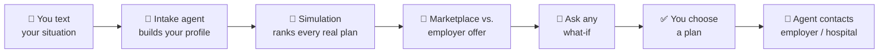
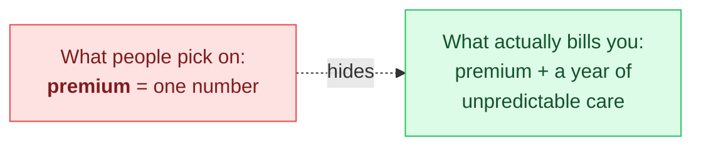
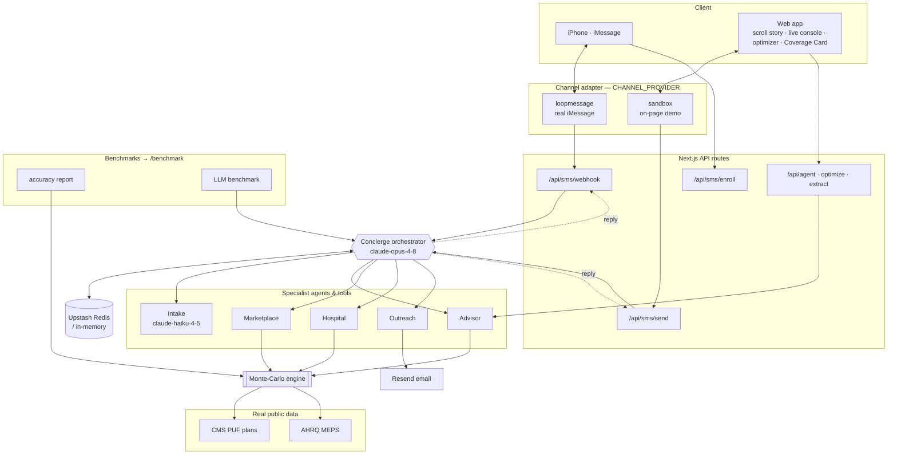

# Covera — the insurance marketplace that texts you the right plan

**Stuck with your employer's two options, or shopping on your own? Text Covera your
situation.** A team of AI agents searches the entire marketplace, simulates what you'd
truly pay, answers any what-if, and — once you choose — reaches out to your employer or
hospital for you.

Every figure traces to public data. No synthetic plans, prices, or claims.

## What it does



| | Capability | What you get |
|---|---|---|
| 💬 | **Texting concierge** | A warm, multi-agent advisor you text like a person. It remembers your life — fears, constraints, preferences — not just your form fields. |
| 🎲 | **Stochastic cost engine** | Plans ranked by **risk-adjusted all-in cost** (premium + out-of-pocket), with best/worst case, the odds you hit your OOP max, and the cost-vs-risk frontier. |
| 🏪 | **Marketplace comparator** | Your employer offer vs. the **whole on-exchange market**, net of the subsidy you actually qualify for. |
| 🪪 | **Coverage Card** | A portable QR/link card — providers see your coverage and a live cost estimate with **zero access to your records** (the card lives in the link). |
| 🧑‍⚕️ | **Three lenses** | Patient optimizer · Employer ICHRA modeler · Hospital cost desk — one engine, three views. |
| 📨 | **Outreach** | Drafts (and optionally sends) messages to your employer's HR or a hospital after you finalize a plan. |
| 📊 | **Benchmarks** | An honest accuracy scorecard for the simulation and a multi-model LLM benchmark at `/benchmark`. |

## Why simulate thousands of years?

A premium is **one number**. Your real cost is a **distribution** — and the two rarely agree.



Each simulated "year" samples your likely care from real AHRQ MEPS utilization data — how
many primary-care visits, labs, ER trips, prescriptions, plus your conditions and planned
events — then runs that year through a plan's actual deductible, coinsurance, and
out-of-pocket-max rules. **One** simulated year is just a guess. Run it **thousands** of
times and the shape emerges: a typical year, an expected cost, and the bad-year tail.

That tail is the whole point. Healthcare spending is extremely skewed — **the top 5% of
people drive ~50% of all spending** — so a single average hides the catastrophic year that
actually bankrupts people. Covera ranks plans on **expected cost + a downside-risk penalty**
(p90 cost, probability of hitting your OOP max), which is why the "cheapest" plan often
isn't the right one once your real risk is on the table.

## System design



A **lead orchestrator** owns the conversation and delegates to specialist agents/tools; the
deterministic ones (advisor, marketplace, hospital) call the simulation so every number is
real, and the LLM sub-agents (intake, outreach) handle extraction and drafting. The channel
adapter makes delivery pluggable — real iMessage or the on-page sandbox.

**Code map:** `lib/agents/` (orchestrator + specialists) · `lib/channel/` (sandbox /
loopmessage) · `lib/store/` (Redis + memory fallback) · `lib/sim/` (Monte-Carlo engine) ·
`lib/benchmark/` · `components/text/` (iMessage UI, scroll story, live console) ·
`app/api/sms/` · `scripts/{accuracy,benchmark}/`.

## Run it locally

```bash
npm install
cp .env.example .env.local      # optional — add only the keys you want
npm run dev                     # http://localhost:3000
```

**Nothing is required** to run, scroll the landing story, use the optimizer, build a Coverage
Card, or generate the accuracy report. Each service below unlocks more — the app degrades
gracefully when one is absent (exactly like the existing `ANTHROPIC_API_KEY` guard).

| Service | Required? | Unlocks | Get a key |
|---|---|---|---|
| _(none)_ | — | Optimizer, charts, Coverage Card, scripted landing story, `npm run accuracy` | — |
| **Anthropic** `ANTHROPIC_API_KEY` | Recommended | The live agent (in-app assistant, voice→profile, live console) and `npm run benchmark` | console.anthropic.com |
| **Upstash Redis** `UPSTASH_REDIS_REST_URL` / `_TOKEN` | Optional | Conversation memory that survives across texts and serverless cold starts (else in-memory) | upstash.com |
| **LoopMessage** `LOOPMESSAGE_*` + `CHANNEL_PROVIDER=loopmessage` | Optional | Real blue-bubble iMessage delivery (else the on-page sandbox console) | loopmessage.com |
| **Resend** `RESEND_API_KEY` / `OUTREACH_FROM_EMAIL` | Optional | Actually sending outreach to employers/hospitals (else draft-only preview) | resend.com |

```bash
npm test          # engine + agent unit tests
npm run typecheck # tsc --noEmit
npm run build     # production build
npm run accuracy  # data/accuracy-report.json   (no key needed)
npm run benchmark # data/llm-benchmark.json      (needs ANTHROPIC_API_KEY)
npm run ingest    # rebuild data/plans.*.json from the CMS PUFs (~700MB download)
```

## Real data sources

| Need | Source |
|---|---|
| Plans, premiums, deductibles, OOP max, cost-sharing | **CMS Health Insurance Exchange Public Use Files, PY2026** (data.healthcare.gov) |
| Care utilization & expenditure calibration | **AHRQ Medical Expenditure Panel Survey (MEPS)** |
| Premium subsidies | ACA **APTC** via the second-lowest-cost silver benchmark |
| Procedure prices (billed & Medicare-allowed) | **CMS Medicare Physician & Other Practitioners — by Geography and Service** (data.cms.gov), via `npm run ingest:prices` |

Bundled states: **TX, FL, NC, OH** (federal-exchange markets, ~1,600 real plans).

## Benchmarks (`/benchmark`)

Two honest scorecards answer "how accurate is this, really?":

- **Simulation accuracy** — validates the engine against the MEPS aggregates it claims to
  reproduce (mean spend by age band, spend concentration) and the ACA subsidy formula. It
  shows both where the engine is accurate (adult means, subsidy math) and where it diverges
  (it compresses the heavy right tail). → `data/accuracy-report.json`
- **LLM model benchmark** — runs a fixed question suite through `claude-opus-4-8`,
  `claude-sonnet-4-6`, and `claude-haiku-4-5` driving the real agent tools, scoring
  faithfulness (cites real numbers vs. hallucinates), tool-use accuracy, quality (LLM
  judge), latency, and **real cost** (token usage × published pricing). → `data/llm-benchmark.json`

## Texting setup (real iMessage)

Apple has no official iMessage API, so blue-bubble delivery uses a relay. Set
`CHANNEL_PROVIDER=loopmessage` + the `LOOPMESSAGE_*` keys and point your LoopMessage webhook
at `/api/sms/webhook`. Without those, `CHANNEL_PROVIDER=sandbox` (default) routes the same
multi-agent loop to the on-page live console — fully exercisable with no third-party account.

## Tech

Next.js 16 (App Router) · TypeScript · Tailwind v4 · `motion` for scroll/entry animation ·
hand-built SVG charts · Anthropic Claude (`claude-opus-4-8` concierge/advisor,
`claude-haiku-4-5` intake) · Upstash Redis · LoopMessage · Resend · Web Speech API · Vercel.
The simulation engine is pure TypeScript in `lib/sim/` and unit-tested.

## How the data is built

`scripts/ingest_pufs.py` streams the real CMS PY2026 Plan Attributes, Rate, and Benefits &
Cost-Sharing PUFs, filters to the bundled states, parses the human-readable cost-sharing
strings (e.g. `"20% Coinsurance after deductible"`) into a typed schema, and emits the
compact `data/plans.<state>.json` the app ships. Raw downloads are gitignored; only the
normalized JSON is committed.

---

*Covera is decision support, not insurance advice. Estimates model your inputs against real
plan rules; confirm specifics with the issuer before enrolling.*
